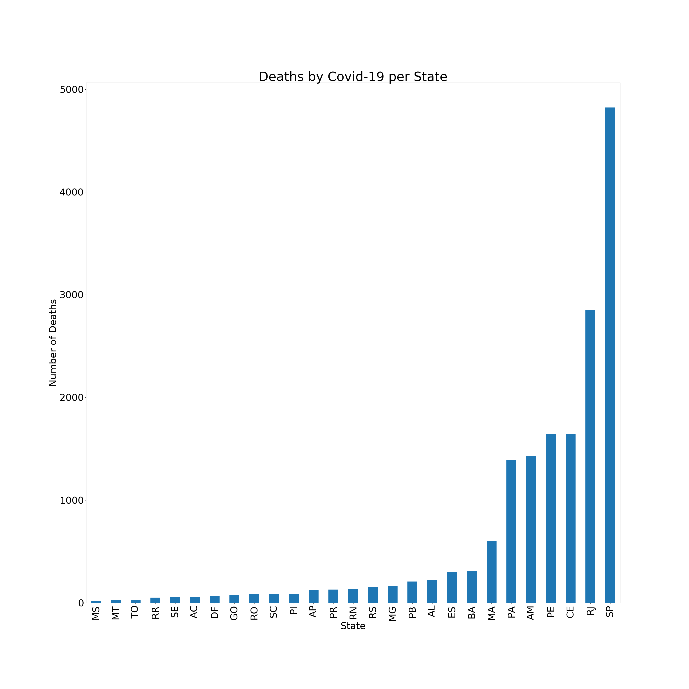

# Covid 19 Data Analysis from Brasil.io

#### This is a personal project where I tried to create an analysis of Brasil.io Covid-19 dataset as of 18/05/2020
---

### DISCLAIMER: data may vary from official fonts because when the results of tests are released, past data may be updated with new information

You can find the original dataset at this [link](https://www.kaggle.com/rafaelds/covid19-brasilio).

---

### Graphics made from this dataset:
**Deaths by State**:

**Deaths by city in Ceará (top 20):**

**Confirmed cases per 100k inhabitants by city in Ceará (top 20):** 

**Total deaths per day in Fortaleza**
