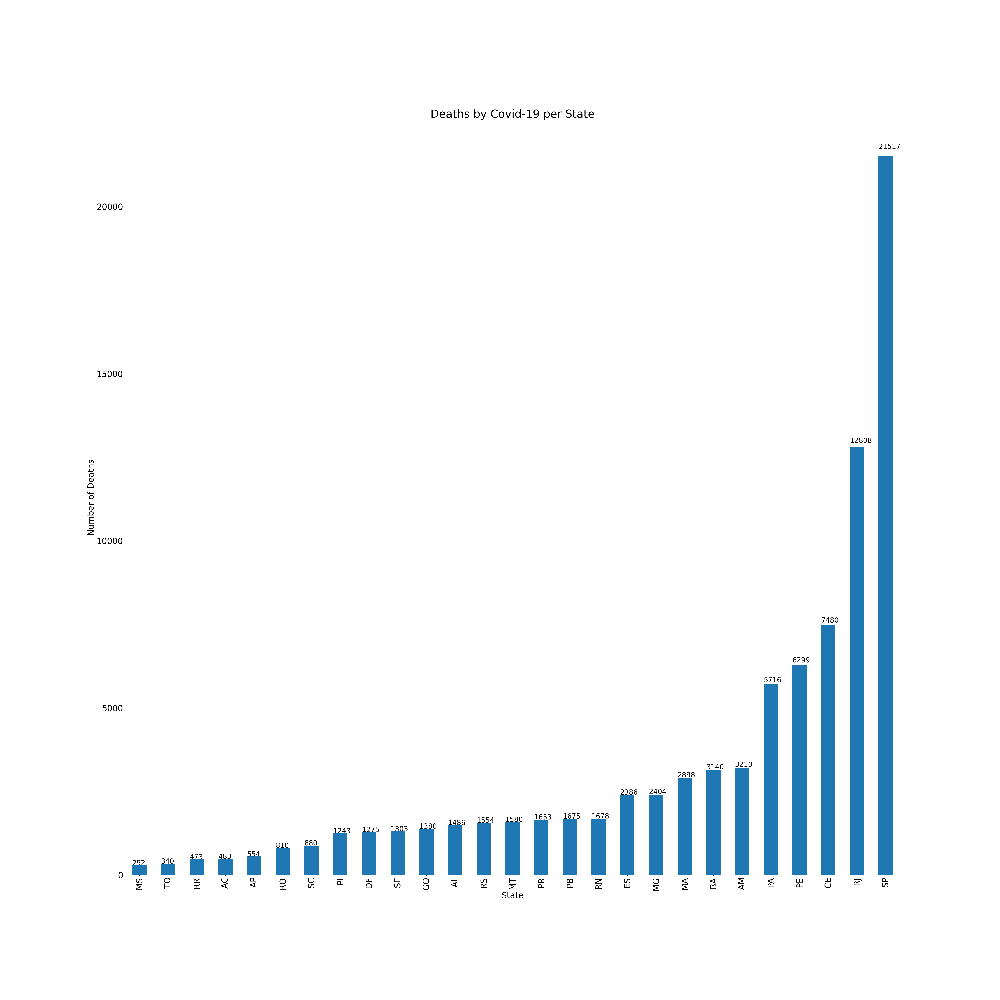

# Covid 19 Data Analysis from Brasil.io

#### This is a personal project where I tried to create an analysis of Brasil.io Covid-19 dataset as of 20/05/2020
---

You can find the original dataset at this [link](https://www.kaggle.com/rafaelds/covid19-brasilio).

### Some graphics made from this data:
**Deaths by State**:

**Deaths by city in Ceará (top 20):**

**Total deaths per day in Fortaleza**